## Project 12:Ansible Refactoring And Static Assignment (Imports And Roles) Project

First Step – Jenkins job enhancement.

1. Go to your Jenkins-Ansible server and create a new directory called ansible-config-artifact – we will store there all artifacts after each build.

- Run `sudo mkdir /home/ubuntu/ansible-config-artifact`

2. Change permissions to this directory, so Jenkins could save files there.

- Run `sudo chmod -R 0777 /home/ubuntu/ansible-config-artifact`

3. Go to Jenkins web console and install "Copy Artifacts" pligin-> Manage Jenkins -> Manage Plugins -> on Available tab search for "Copy Artifact plugin and install this plugin without restarting Jenkins.

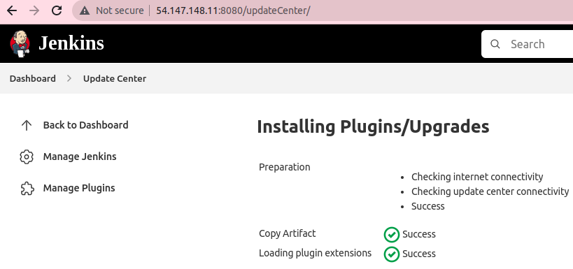

4. Create a new Freestyle project and name it - save_artifacts.

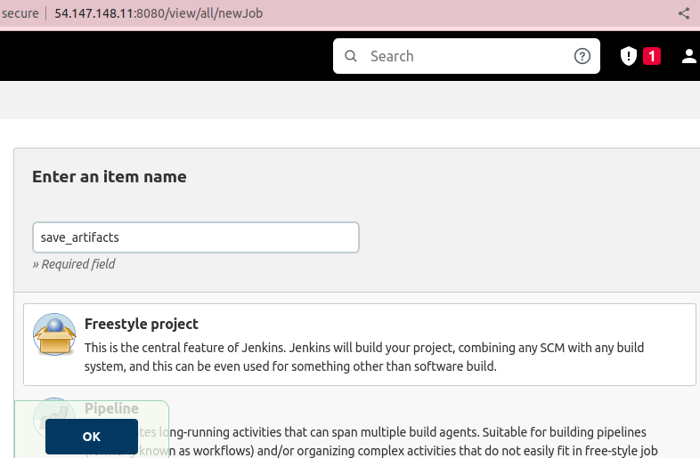

5. Configure the project. 

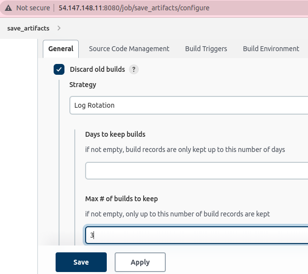

6. Create a Build step and choose Copy artifacts from other project, specify ansible as a source project and /home/ubuntu/ansible-config-artifact as a target directory.

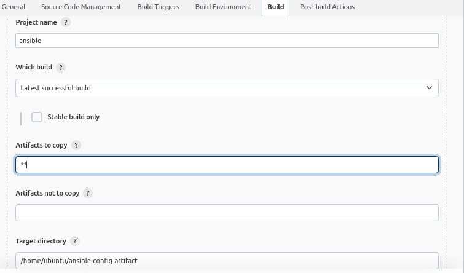

7. Test the set up by making some changes in README.MD file inside ansible-config-mgt repository. If both Jenkins jobs have completed one after another – you shall see your files inside /home/ubuntu/ansible-config-artifact directory and it will be updated with every commit to your master branch.

Second Step – Refactor Ansible code by importing other playbooks into site.yml

1. Before starting to refactor the codes, ensure that you have pulled down the latest code from master (main) branch, and created a new branch, name it refactor.

2. Within playbooks folder, create a new file and name it site.yml. Create a new folder in root of the repository and name it static-assignments.

4. Move common.yml file into the newly created static-assignments folder. Inside site.yml file, import common.yml playbook.

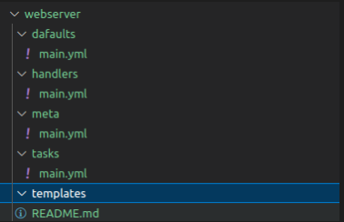

5. Create another playbook under static-assignments and name it common-del.yml. In this playbook, configure deletion of wireshark utility.

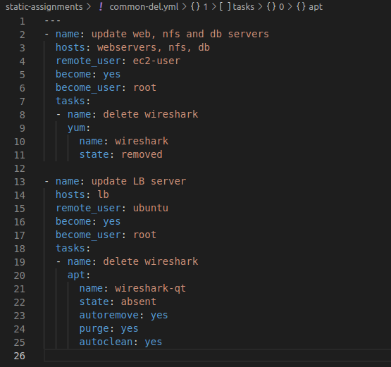

- update site.yml with import_playbook: ../static-assignments/common-del.yml instead of common.yml. By default path to inventory is /etc/ansible/hosts. Change the path in ansible.cfg file and then run it against dev servers:

- Run `sudo vi /etc/ansible/ansible.cfg`, uncomment and add path to inventory line then save. Confirm host availability with `ansible all -m ping`.

- Run `cd /home/ubuntu/ansible-config-artifact/`

- Run `ansible-playbook -i inventory/dev.yml playbooks/site.yml`

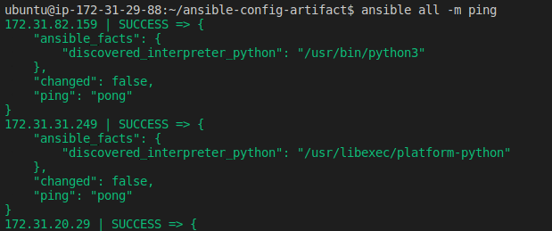
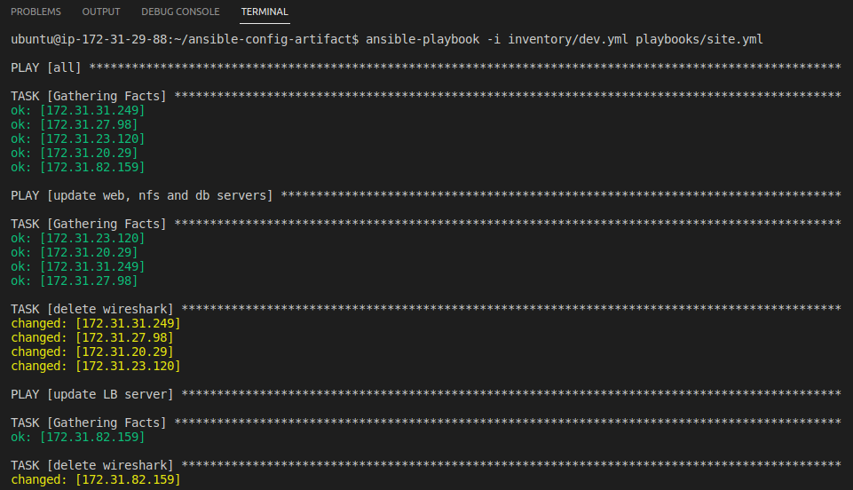

- check that wireshark is deleted on all the servers.
  - Run `which wireshark` or `wireshark --version`

Third Step – Configure UAT Webservers with a role ‘Webserver’

1. Launch 2 fresh EC2 instances using RHEL 8 image, we will use them as our uat servers, so give them names accordingly – Web1-UAT and Web2-UAT (Only Web Servers and the existing Jenkins-Ansible server up and running).

2. To create a roles directory and a folder called webserver, relative to the playbook file in Github rather than locally on Jenkins-Ansible server with necessary folders and files.

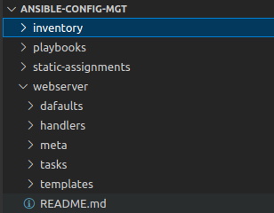

3. Update your inventory ansible-config-mgt/inventory/uat.yml file with IP addresses of your 2 UAT Web servers (use SSh agent).

4. In /etc/ansible/ansible.cfg file uncomment roles_path string and provide a full path to your roles directory roles_path    = /home/ubuntu/ansible-config-mgt/roles, so Ansible could know where to find configured roles.

- Also, make sure to add path to private key file added to ssh-agent. 

5. Configuration tasks to be performed in the tasks/main.yml file to do the following:

- Install and configure Apache (httpd service)
- Clone Tooling website from GitHub https://github.com/<your-name>/tooling.git.
- Ensure the tooling website code is deployed to /var/www/html on each of 2 UAT Web servers.
- Make sure httpd service is started.

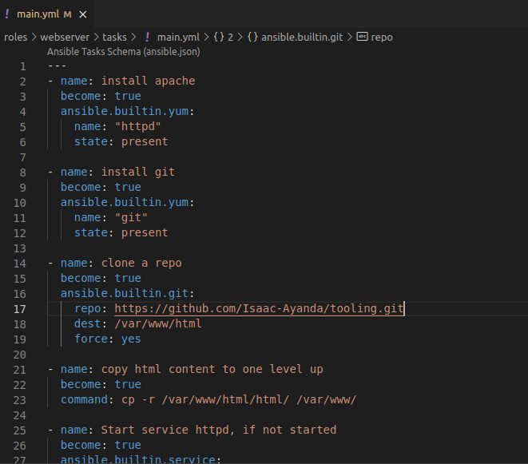

Forth Step – Reference ‘Webserver’ role

1. Within the static-assignments folder, create a new assignment for uat-webservers as uat-webservers.yml.

  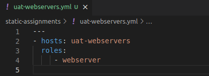

- Refer to uat-webservers.yml role inside site.yml being the entry point to the anible configuration. 

Fifth Step – Commit & Test
1. Commit your changes, create a Pull Request and merge them to master branch, make sure webhook triggered two consequent Jenkins jobs, ran successfully and copied all the files to your Jenkins-Ansible server into /home/ubuntu/ansible-config-artifact/ directory.

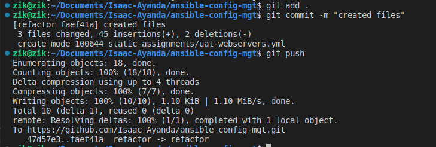

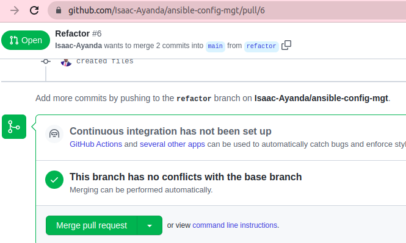

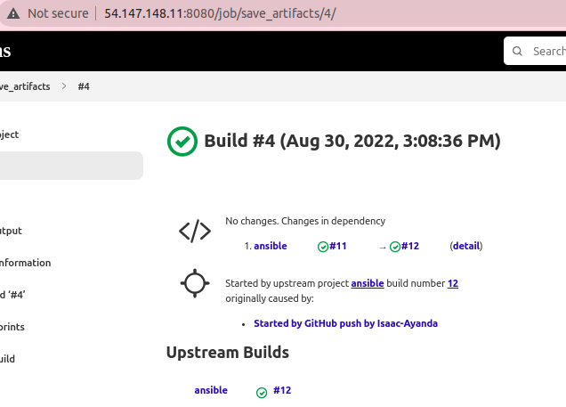

- Now run the playbook against your uat inventory and see what happens:

  - Run `sudo ansible-playbook -i /home/ubuntu/ansible-config-artifact/inventory/uat.yml /home/ubuntu/ansible-config-artifact/playbooks/site.yml`

  

  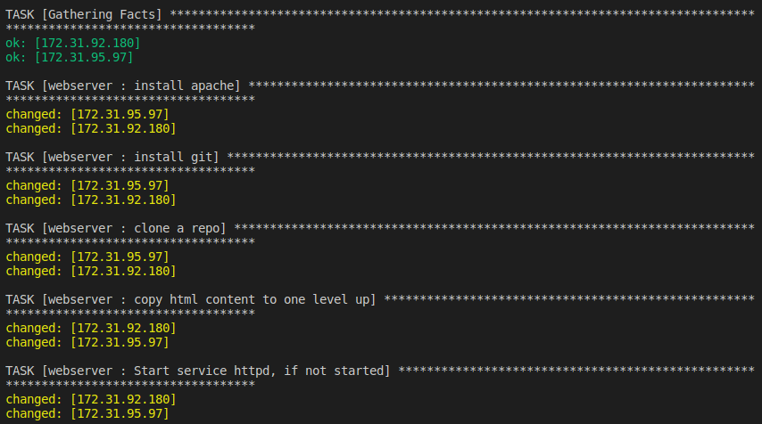
   

- UAT Web servers configured and and solutions accessible via web browsers accordingly.

- Make sure to enable http in the inbound rule on tcp port 80 in AWS

